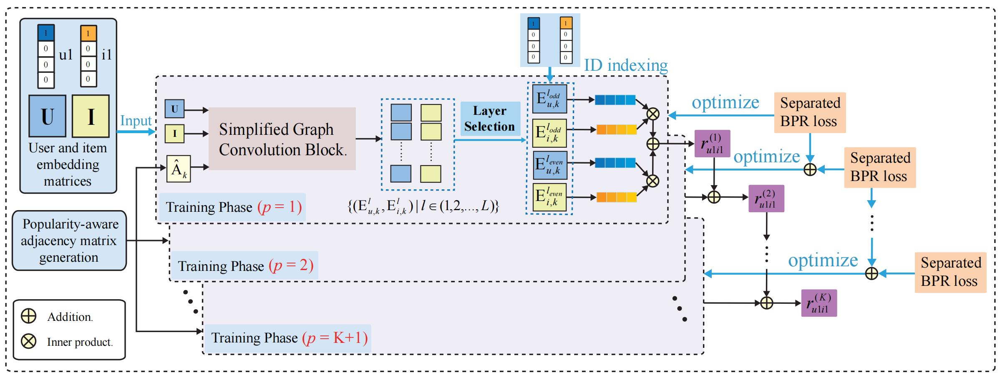

# JMP-GCF
Paper link: https://ieeexplore.ieee.org/stamp/stamp.jsp?tp=&arnumber=9730040
## Joint Multi-grained Popularity-aware Graph Convolution Collaborative Filtering for Recommendation

Graph Convolution Networks (GCNs), with their efficient ability to capture high-order connectivity in graphs, have been widely applied in recommender systems. 
Stacking multiple neighbor aggregation is the major operation in GCNs. It implicitly captures popularity features because the number of neighbor nodes reflects the popularity of a node. However, existing GCN-based methods ignore a universal problem: users' sensitivity to item popularity is differentiated, but the neighbor aggregations in GCNs actually fix this sensitivity through Graph Laplacian Normalization, leading to suboptimal personalization.
			
In this work, we propose to model multi-grained popularity features and jointly learn them together with high-order connectivity, to match the differentiation of user preferences exhibited in popularity features. Specifically, we develop a Joint Multi-grained Popularity-aware Graph Convolution Collaborative Filtering model, short for JMP-GCF, which uses a popularity-aware embedding generation to construct multi-grained popularity features, and uses the idea of joint learning to capture the signals within and between different granularities of popularity features that are relevant for modeling user preferences. Additionally, we propose a multistage stacked training strategy to speed up model convergence. We conduct extensive experiments on three public datasets to show the significant improvements of JMP-GCF over the state-of-the-art approach (up to 23.17% improvement, with an average improvement of 10.96%).

We provide tensorflow implementation for JMP-GCF.

## Prerequisites

- Tensorflow 1.10.0
- Python 3.5
- NVIDIA GPU + CUDA + CuDNN

## Citation :satisfied:
If our paper and code are useful to you, please cite:

@ARTICLE{jmpgcf,  
author={Liu, Kang and Xue, Feng and He, Xiangnan and Guo, Dan and Hong, Richang},  
journal={IEEE Transactions on Computational Social Systems},   
title={Joint Multi-Grained Popularity-Aware Graph Convolution Collaborative Filtering for Recommendation},   
year={2022},  
volume={},  
number={},  
pages={1-12},  
doi={10.1109/TCSS.2022.3151822}
}
